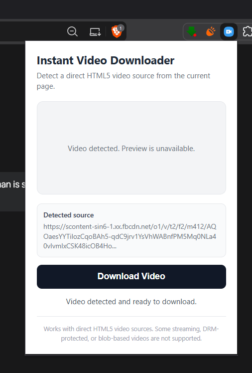

# Instant Video Downloader

A lightweight Chrome extension that detects direct HTML5 video sources on the active webpage and allows users to download them using the Chrome Downloads API.

The extension also attempts to capture a video frame and display it as a thumbnail preview when browser security restrictions allow it.

## Screenshot



## Features

- Detects HTML5 `<video>` elements
- Extracts direct HTTP and HTTPS video sources
- Supports `<video src="">` and nested `<source>` elements
- Attempts to capture a video frame as a thumbnail
- Falls back to the video's poster image when available
- Downloads detected videos using the Chrome Downloads API
- Detects common video file extensions
- Uses Chrome Extension Manifest V3
- No external dependencies

## Technologies Used

- JavaScript
- HTML
- CSS
- Chrome Extension Manifest V3
- Chrome Scripting API
- Chrome Downloads API
- HTML5 Video API
- Canvas API

## Project Structure

```text
VideoDownloader/
├── icon16.png
├── icon48.png
├── icon128.png
├── manifest.json
├── popup.html
├── popup.js
├── .gitignore
└── README.md
```

## Installation

1. Download or clone this repository.
2. Open Google Chrome.
3. Go to `chrome://extensions`.
4. Enable **Developer mode**.
5. Click **Load unpacked**.
6. Select the project folder.
7. The extension will appear in the Chrome toolbar.

## Usage

1. Open a webpage containing an HTML5 video.
2. Allow the video to load.
3. Click the **Instant Video Downloader** extension icon.
4. The extension scans the active page for direct video sources.
5. If a supported video source is detected, click **Download Video**.
6. Choose where you want to save the file.

## How It Works

The extension uses Chrome's `activeTab` and `scripting` APIs to run a video-detection function inside the currently active webpage.

The detection function searches the webpage for HTML `<video>` elements and checks:

- `video.currentSrc`
- `video.src`
- nested `<source>` elements

Only direct HTTP or HTTPS media URLs are treated as supported downloadable sources.

When possible, the extension attempts to capture a frame from the video using the HTML Canvas API.

If frame capture is blocked, the extension attempts to use the video's poster image as a fallback.

The selected media URL is then passed to the Chrome Downloads API.

## Permissions

The extension requests only the permissions needed for its current functionality.

### `activeTab`

Provides temporary access to the current webpage after the user activates the extension.

### `scripting`

Allows the extension to execute the video-detection function inside the active tab.

### `downloads`

Allows the extension to start downloads through Chrome's Downloads API.

The extension does not request permanent access to all websites.

## Known Limitations

This project is designed for direct HTML5 video sources.

It may not work with:

- `blob:` video URLs
- DRM-protected content
- Media Source Extensions
- DASH streams
- some HLS streams
- encrypted streaming services
- websites that do not expose a direct media URL

Thumbnail generation may also be unavailable for some cross-origin videos because browser security restrictions can prevent video frames from being exported through the Canvas API.

In such cases, the video may still be detected and downloadable even when a preview cannot be displayed.

## Privacy

This extension does not collect, store, or transmit personal information.

Video detection is performed locally inside the user's browser.

## Responsible Use

This project is intended for educational purposes and for downloading media that users own or are authorized to download.

Users are responsible for complying with applicable copyright laws and website terms of service.

## What I Learned

While working on this project, I explored:

- Chrome extension architecture
- Manifest V3
- browser permissions
- DOM interaction
- asynchronous JavaScript
- Chrome extension APIs
- HTML5 video elements
- Canvas-based frame capture
- browser cross-origin restrictions
- basic Git and GitHub workflow

## Future Improvements

Possible future improvements include:

- displaying multiple detected videos
- allowing users to select a video source
- showing video resolution and format
- improving filename detection
- improving thumbnail fallbacks
- improving streaming format detection
- adding automated tests

## Project Status

The current version focuses on detecting and downloading direct HTML5 video sources with minimal browser permissions.

This project is being developed as a learning project to better understand JavaScript, browser APIs, Chrome extensions, and Git/GitHub workflows.